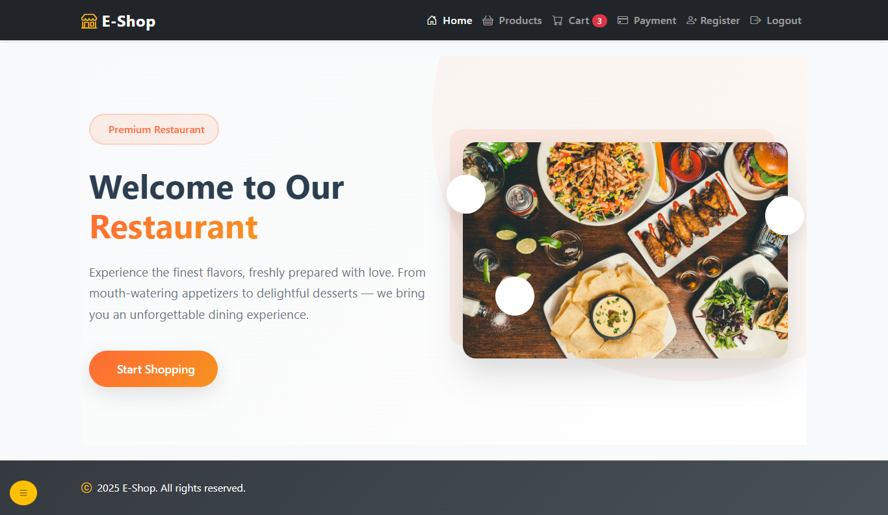
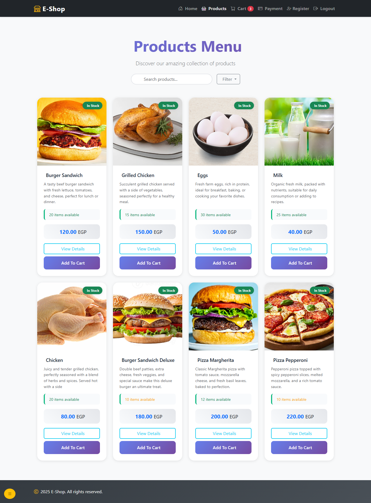
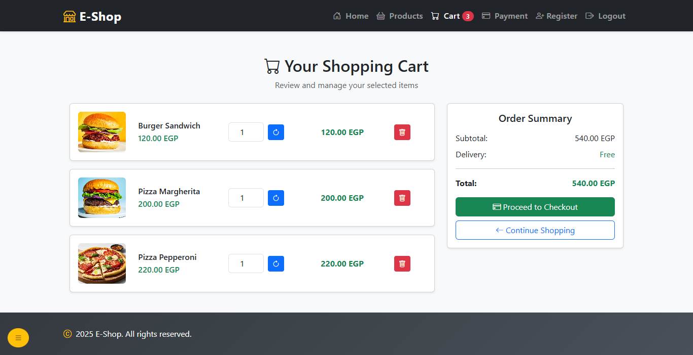
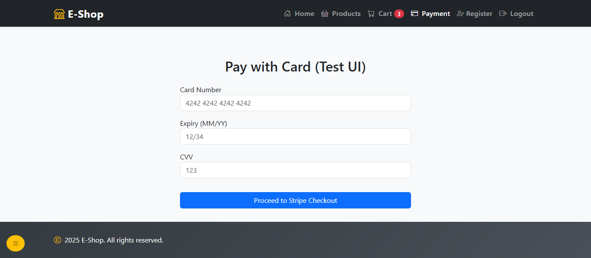
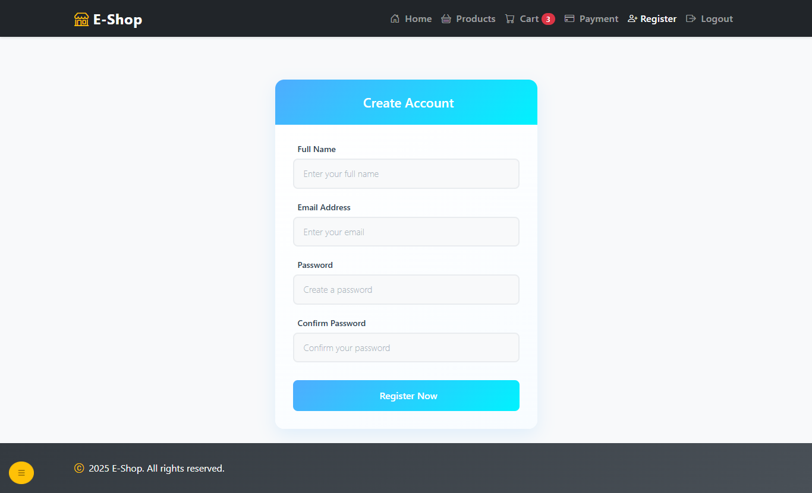

# 🛒 E-Commerce Project

This is a simple e-commerce project built with **Laravel**.  
It includes essential features such as product listing, cart management, user authentication, and payment integration using **Stripe**.

---

## 🚀 Features
- User registration & login
- Product listing with images
- Add to cart & cart management
- Secure payment with Stripe
- Responsive design

---

## 📸 Screenshots

### 🏠 Welcome Page
This is the landing page of the website.  


---

### 🛍️ Products Page
Displays all products with details and an option to add them to the cart.  


---

### 🛒 Cart Page
Shows all selected products with total price and checkout button.  


---

### 💳 Payment Page
Stripe integration for secure payment.  


---

### 👤 Register / Login
User authentication system with registration and login forms.  


---

## ⚙️ Installation

1. Clone the repository:
   ```bash
   git clone git@github.com:omar571mamdouh/E-commerce-Project.git
